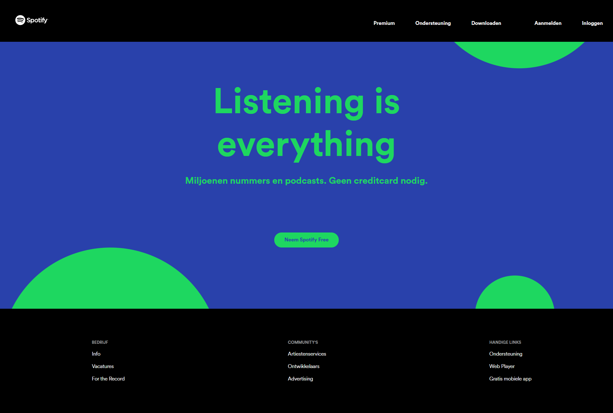
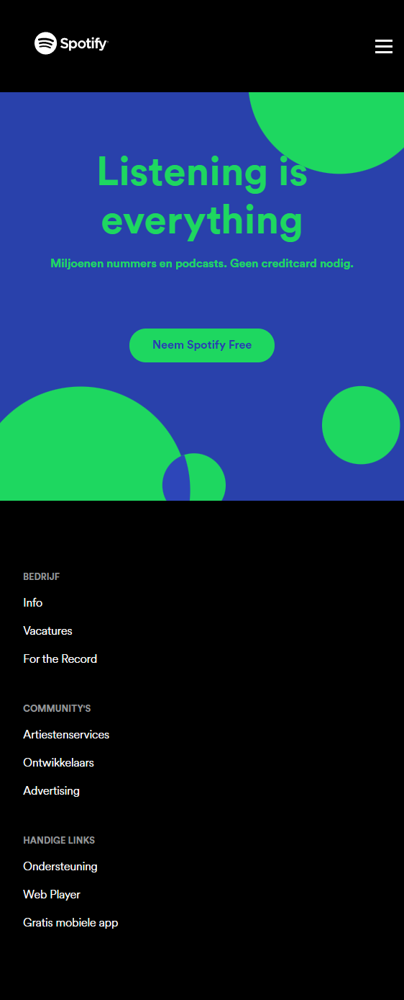
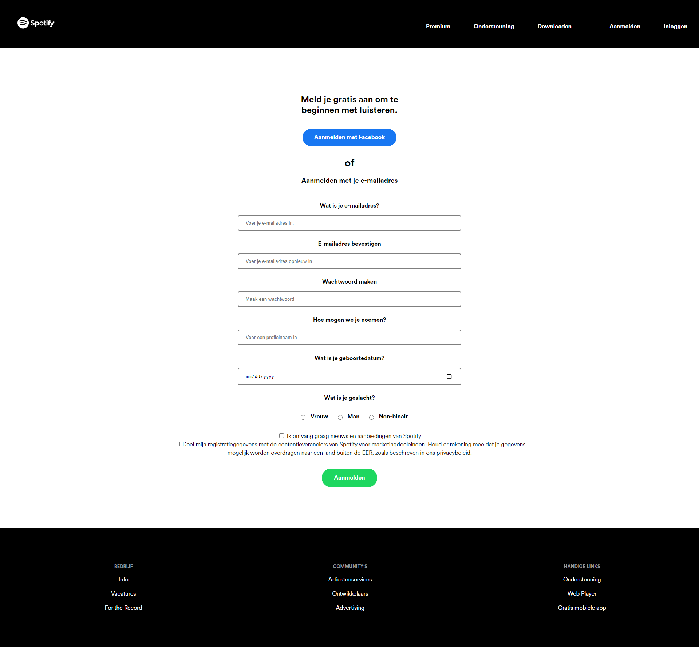
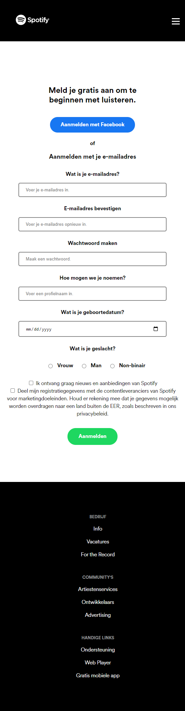

# Procesverslag
Markdown is een simpele manier om HTML te schrijven.  
Markdown cheat cheet: [Hulp bij het schrijven van Markdown](https://github.com/adam-p/markdown-here/wiki/Markdown-Cheatsheet).

Nb. De standaardstructuur en de spartaanse opmaak van de README.md zijn helemaal prima. Het gaat om de inhoud van je procesverslag. Besteedt de tijd voor pracht en praal aan je website.

Nb. Door *open* toe te voegen aan een *details* element kun je deze standaard open zetten. Fijn om dat steeds voor de relevante stuk(ken) te doen.

## Jij

uitwerken voor kick-off werkgroep

### Auteur:
Jaron Korsaan

#### Je startniveau:
Blauw

#### Je focus:
Responsive
 

## Je website

uitwerken voor kick-off werkgroep

### Je opdracht:
https://www.spotify.com/

#### Screenshot(s) van de eerste pagina (small screen): 
Spotify - Home  

#### Screenshot(s) van de tweede pagina (small screen):
Spotify Sign Up 

 

## Breakdownschets (week 1)

Week 1

### de hele pagina:
 

### dynamisch deel (bijv menu): 
 

## Voortgang 1 (week 2)

uitwerken voor 1e voortgang

### Stand van zaken
Opstarten was niet het makkelijkst, was weer een tijdje geleden dat ik iets met HTML en CSS had gedaan. Maar eenmaal toen ik de draai te pakken had, ging het goed en had ik maar een paar obstakels omdat ik nog net niet goed HTML en CSS onder de knie heb. Ik heb daarom ook gekozen voor de blauwe piste, zodat ik niet in dezelfde problemen kom als vorig jaar. Toen had ik een ambitieus idee, maar de uitwerking was niet zo makkelijk. HTML en CSS voor de eerste pagina is bijna klaar, naast dat ik nog een aantal aanpassingen moet doen op de CSS. Het menu is gelukt in JavaScript.

### Verslag van meeting
Door middel van de hulp van de studentenassistente kon ik verder met mijn website. Het hamburgermenu was nog een grote obstakel maar dat is nu gelukt aan de hand van drie keer een div binnen een button te zetten, waardoor het nog wel een button blijft EN dat het hele oppervlak klikbaar is in plaats van alleen de witte streepjes die het hamburgermenu moeten voorstellen.

## Voortgang 2 (week 3)

uitwerken voor 2e voortgang

### Stand van zaken
De eerste pagina is vrijwel helemaal af, ik moet nog een aantal responsive elementen toevoegen om het echt af te noemen. Ik heb wel een aantal problemen met hoe ik tekst moet scalen, en wat ik moet doen als de browser de font niet kan lezen.

### Verslag van meeting
Door gebruik te maken van media quiries kan ik de website responsive maken, waarbij bijvoorbeeld het hamburgermenu weggehaald kan worden. Verder heb meegekregen dat ik fallback fonts voor de website moet gaan gebruiken, en de tekst door middel van 'clamp' te scalen. 

## Toegankelijkheidstest (week 4)

uitwerken na test in 8e voortgang

### Bevindingen
Met het parkinson apparaat werd het navigeren op telefoon en laptop lastiger, maar zeker niet onmogelijk.
De bril waarbij er alleen maar zicht is door een klein gaatje maakt het navigeren enorm lastig.
De andere brillen maakte voor mij de navigatie niet een probleem.

#### Parkinson
Door het parkinson apparaat heb ik ondervonden dat de knoppen groot genoeg moeten zijn, en het geen priegelwerk moet gaan worden. Maar dat is al zo in de huidige mobiele en webversie, dus daar hoeft niets op bedacht worden, naast dat het belangrijk blijft om rekening te blijven houden met de beperking die zich dan voordoet.

#### Zicht limiteren 
De bril die het zicht limiteerde door alleen het midden zichtbaar te maken, liet mij zien dat contrast en grote tekst belangrijk is om de website nog navigeerbaar te houden voor mensen met een soortgelijke beperking. Het scheelt dat waarschijnlijk Spotify hier ook al over na had gedacht, want ik ervaar deze problemen niet op mijn website die vrijwel identiek is.

#### Screenreader 
Met behulp van de screenreader kon ik gemakkelijk bekijken of de website juist is geschreven met de goede selectors. Ik had bij deze test nog geen tweede pagina, dus heb ik alleen de eerste getest. Hierbij kwamen geen obstakels naar voren, en kwam ik er achter dat ik het juist heb geschreven.

#### Overig 
Met de overige brillen werdt het navigeren niet zo drastisch veranderd, en bleef het vrijwel gelijk aan de oorspronkelijke manier van navigeren op de website. Hiervoor hoeven er dus geen aanpassingen gedaan worden.

## Voortgang 3 (week 4)

uitwerken voor 3e voortgang

### Stand van zaken
Ik ben redelijk dichtbij het einde van mijn website. Ik moet dit weekend bezig met de tweede pagina om deze helemaal werkend te krijgen. Verder ben ik tot nu toe erg blij met mijn voortgang, want ik had niet verwacht dat ik het zo netjes zou kunnen maken. Ik ben daar dus tevreden mee. 

### Verslag van meeting
Tijdens het voortganggesprek kreeg ik weinig feedback, aangezien er werd gezegd dat ik goed op weg was en alleen nog maar kleine dingen hoefte te doen. Wel werd er gewaarschuwd dat ik niet heel veel heb aan content. Hier maak ik mij zelf ook een beetje zorgen over, of dit nou wel genoeg is. Maar ik ga er wel vanuit aangezien ik dit heb nagevraagd. Ik ben heel erg benieuwd naar hoe het eindgesprek zal gaan, en ik hoop mijn tweede pagina netjes te kunnen maken dit weekend. 

## Eindgesprek (week 5)

uitwerken voor eindgesprek

### Stand van zaken
In de laatste week / dagen heb ik de tweede pagina gemaakt met een formulier. Dit was nog lastiger dan ik had verwacht. Ik had veel moeite met de responsiveness, maar na een lange tijd was dat toch gelukt. Toen ik het eindgesprek had hebben we beide pagina's bekeken. We kwamen er wel beiden achter dat het formulier niet heel toegankelijk was, waarbij mijn labels nog met een p selector werden gemaakt. Na het eindgesprek heb ik het hele formulier opnieuw geschreven, waardoor het nu wel toegankelijk is geworden, en met de screenreader goed te navigeren is. Ik heb na het eindgesprek en na de veranderingen op de tweede pagina een screenreader test gedaan, om te kijken of het goed is. Deze test kwam goed terug, je kan de website gemakkelijk navigeren.

Ook heb ik meerdere states toegevoegd bij het formulier.

Daarnaast was de footer nog niet helemaal super responsive. Deze heb ik aangepast aan de hand van een media query (flexbox, block). 

### Screenshot(s)

 

 

 

 

## Bronnenlijst

1. https://css-tricks.com/almanac/properties/s/scrollbar/ voor de scrollbar
2. https://fontsfree.pro/base-web-fonts/sans-serif-grotesque/1203-circular-std.html voor het font dat Spotify zelf ook heeft, maar dan met een aantal aanpassingen.
3. https://www.spotify.com/nl/ in de html gekeken naar het logo om te gebruiken.
4. Verder alles zelf geschreven

